# CollabLab - UML and Architecture Diagrams

Version 1.0 - design baseline for the `ft_transcendence` project.

## 1. Scope and assumptions

CollabLab is a private, multi-user collaboration platform. A registered user can create a workspace or join one through an invitation. Workspace resources are never accessible unless the authenticated user has an active membership.

The diagrams assume:

- Frontend: React or Next.js with TypeScript.
- Backend: NestJS with TypeScript.
- Database: PostgreSQL through Prisma ORM.
- Real-time transport: Socket.IO/WebSockets.
- Files: private object storage such as MinIO.
- Authentication: secure HTTP-only cookies or short-lived access tokens with refresh-token rotation.
- Workspace roles: `OWNER`, `ADMIN`, `MEMBER`, and `VIEWER`.
- A modular monolith is used initially; modules can later be extracted if necessary.

## 2. System context diagram

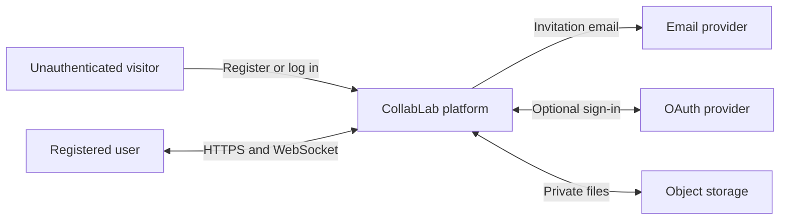

## 3. Use-case diagram

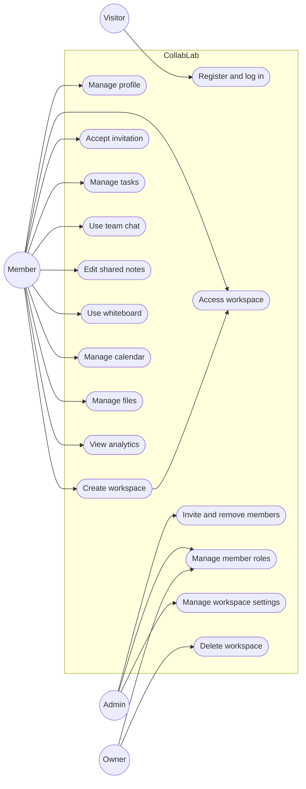

Role specialization: an Owner has Admin and Member capabilities; an Admin has Member capabilities. A Viewer is a restricted Member with read-only access to workspace content.

## 4. Core domain class diagram

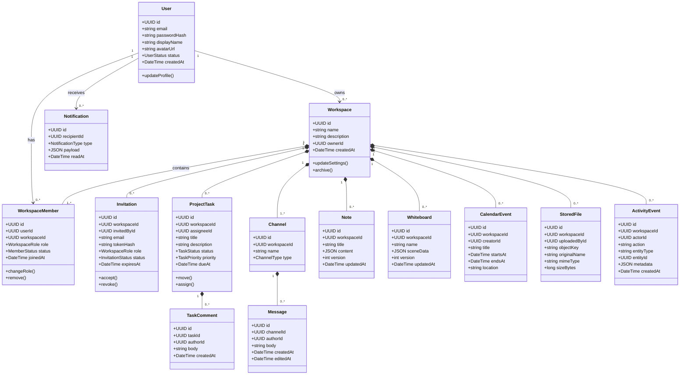

## 5. Database entity-relationship diagram

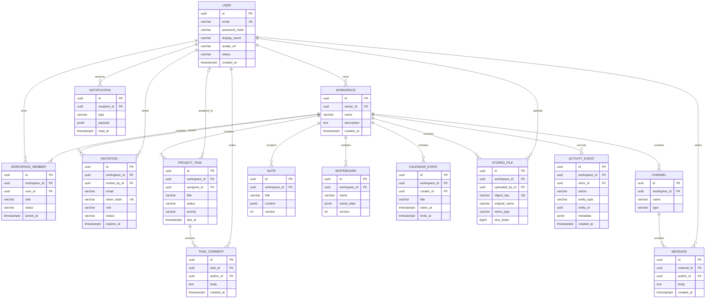

Required database constraints:

- Unique membership on `(workspace_id, user_id)`.
- Unique active invitation on `(workspace_id, email)` where appropriate.
- Every workspace owner must also have an `OWNER` membership.
- Cascading deletion should be used carefully; activity/audit records may require retention or anonymization.
- Index all foreign keys plus common filters such as task status, message creation time, and notification recipient/read state.

## 6. Sequence - registration and login

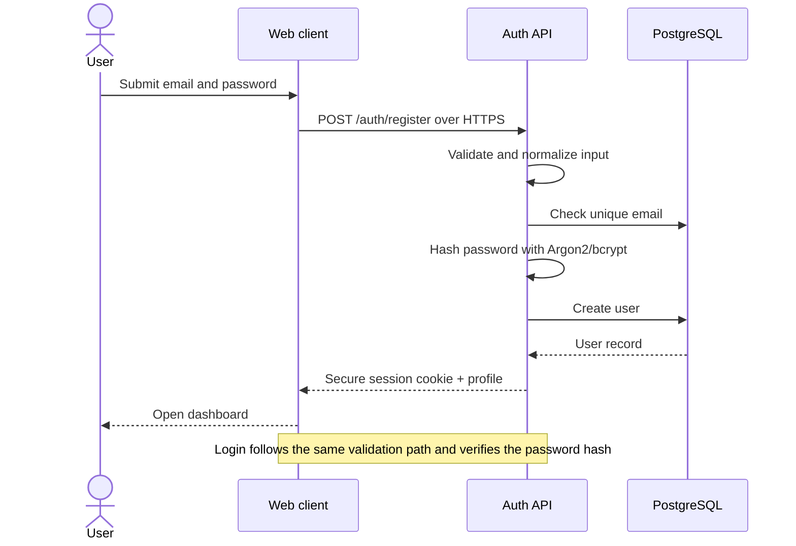

## 7. Sequence - workspace invitation and protected access

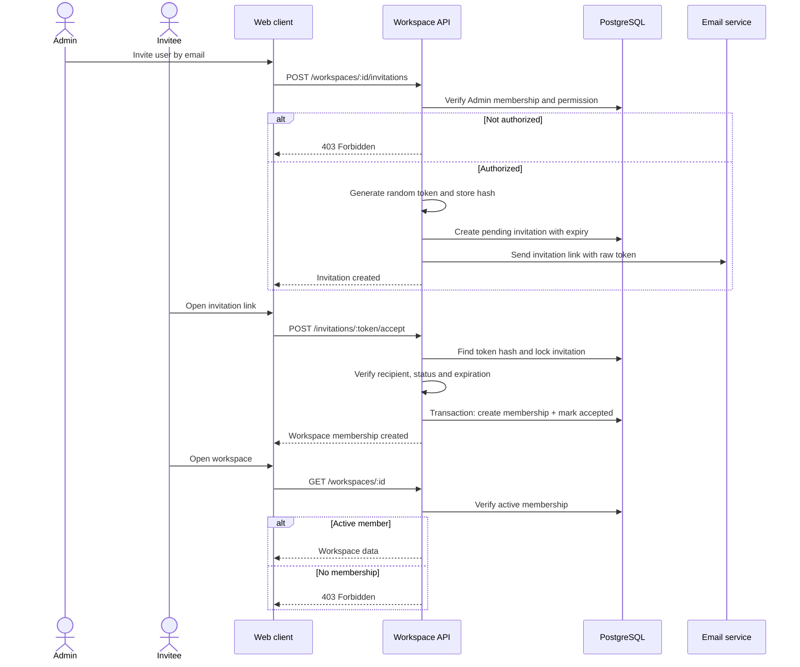

## 8. Sequence - task update with real-time synchronization

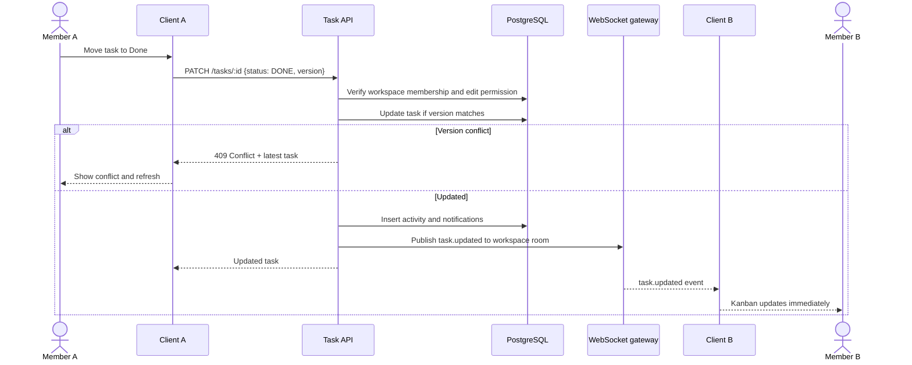

## 9. Sequence - real-time team chat

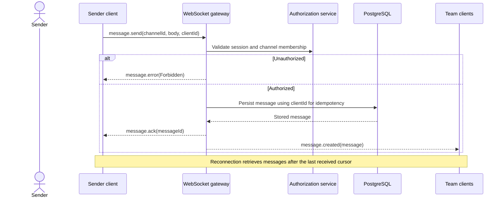

## 10. Sequence - collaborative whiteboard or notes

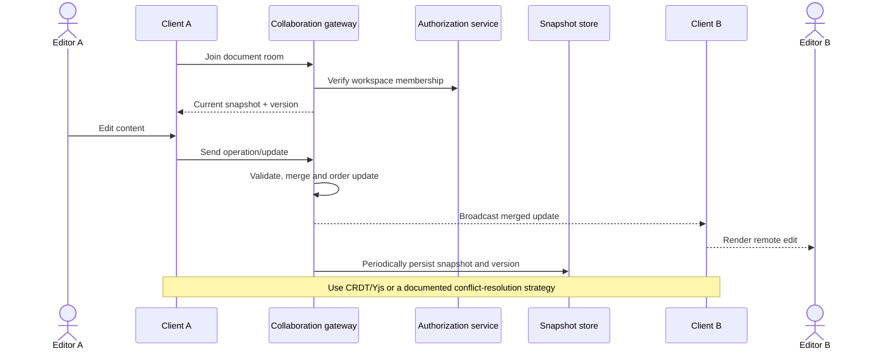

## 11. Activity diagram - workspace creation and collaboration

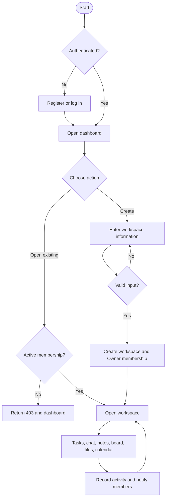

## 12. State diagram - invitation lifecycle

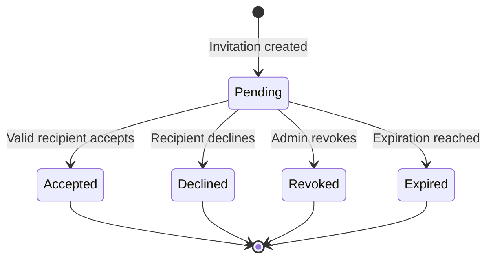

## 13. State diagram - task lifecycle

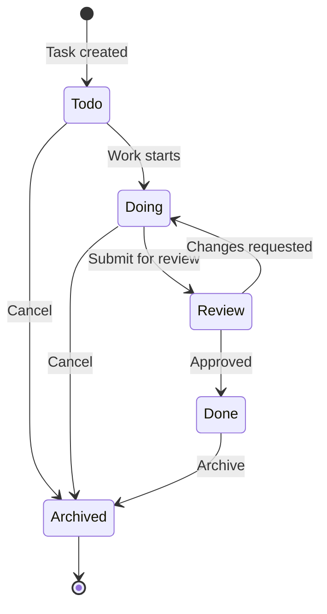

## 14. Component diagram

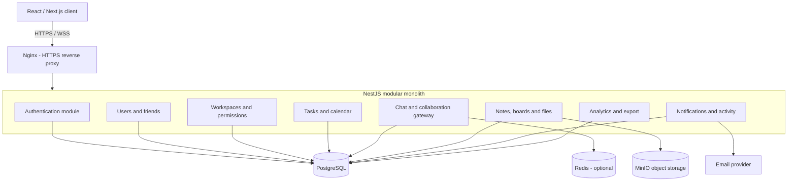

## 15. Deployment diagram

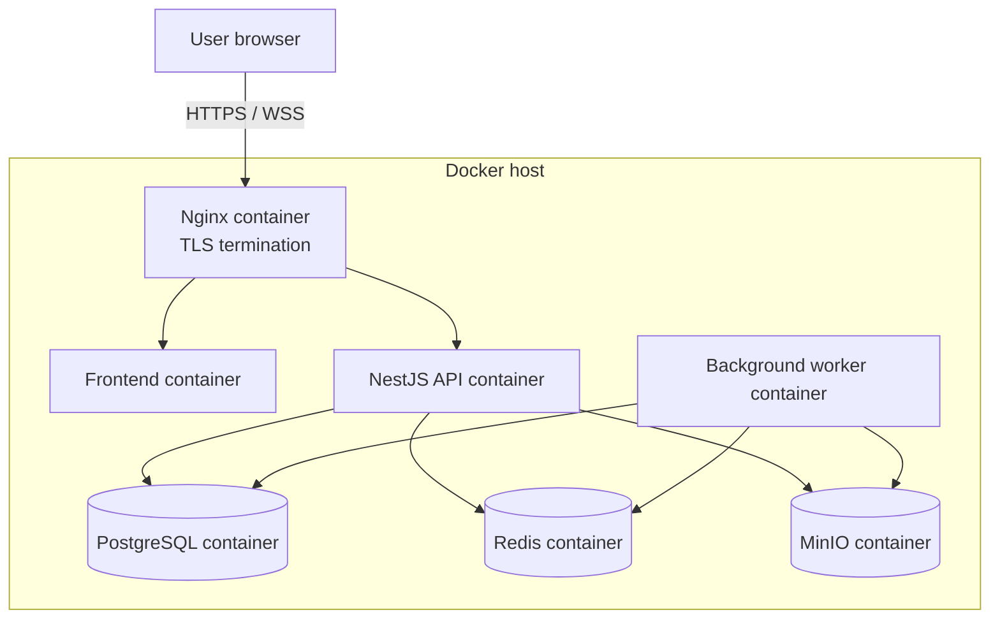

Only the reverse proxy should expose public ports. PostgreSQL, Redis, MinIO and internal services should use a private Docker network.

## 16. Authorization decision flow

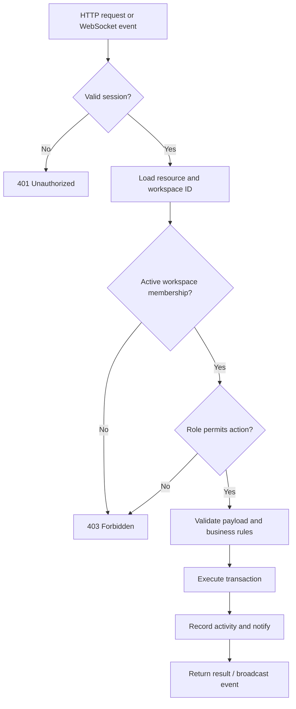

Never accept a workspace ID from the client without independently checking the resource and membership in the backend.

## 17. Permission matrix

| Action | Owner | Admin | Member | Viewer |
|---|:---:|:---:|:---:|:---:|
| View workspace content | Yes | Yes | Yes | Yes |
| Create and update tasks/content | Yes | Yes | Yes | No |
| Delete own messages/comments | Yes | Yes | Yes | No |
| Invite members | Yes | Yes | No | No |
| Remove members | Yes | Yes* | No | No |
| Change roles | Yes | Limited* | No | No |
| Update workspace settings | Yes | Yes | No | No |
| Transfer ownership | Yes | No | No | No |
| Delete workspace | Yes | No | No | No |

`*` An Admin cannot remove, demote or replace the Owner and should not grant the Owner role.

## 18. Recommended API boundaries

| Module | Example endpoints/events |
|---|---|
| Authentication | `POST /auth/register`, `POST /auth/login`, `POST /auth/refresh`, `POST /auth/logout` |
| Workspaces | `GET/POST /workspaces`, `GET/PATCH/DELETE /workspaces/:id` |
| Membership | `GET /workspaces/:id/members`, invite, accept, revoke, role update, remove |
| Tasks | Task CRUD, assignment, status change, comments, `task.updated` |
| Chat | Channel CRUD, message history, `message.send`, `message.created`, typing/read events |
| Notes/boards | Snapshot retrieval, versioned updates, join/leave document events |
| Calendar | Event CRUD and upcoming-deadline queries |
| Files | Metadata, signed upload/download, validation, preview and delete |
| Notifications | List, mark read, real-time `notification.created` |
| Analytics | Date-filtered aggregates plus CSV/PDF export |

## 19. Security and concurrency rules

- Apply authentication, membership and role checks to every HTTP request and WebSocket event.
- Use transactions for accepting invitations, transferring ownership, deleting members and multi-record changes.
- Use optimistic concurrency (`version`) for tasks, notes and boards where overwrites are possible.
- Use idempotency/client IDs for messages and retryable mutations.
- Store only invitation-token hashes; make tokens single-use and time-limited.
- Validate inputs on both client and server, while treating server validation as authoritative.
- Rate-limit authentication, invitations, chat and file endpoints.
- Validate file type, size and content; never trust only the extension or browser MIME type.
- Produce structured audit/activity events for important actions.
- Keep secrets in ignored environment files and provide `.env.example` without real secrets.
- Use HTTPS/WSS for every browser-to-backend connection.

## 20. Suggested implementation order

1. Database schema, authentication and session handling.
2. Workspace, membership, invitation and authorization guards.
3. Tasks, comments and activity events.
4. WebSocket rooms, presence, chat and notifications.
5. Notes and whiteboard synchronization.
6. Calendar and file management.
7. Analytics, export, testing, hardening and documentation.

These diagrams should be updated whenever the team changes the domain model, permissions, technical stack or module selection.
